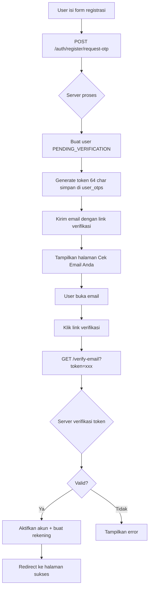

# 🔗 Auth Verification Link - Rencana Implementasi

## Tanggal: 2026-08-04 | Status: Rencana Siap Dikerjakan

---

## Ringkasan

Mengubah alur verifikasi registrasi dari **input kode OTP** menjadi **klik link verifikasi di email**. Client meminta perubahan ini untuk UX yang lebih baik (1 klik vs copy-paste kode).

Selain itu, ditemukan beberapa bug di fitur auth lainnya yang perlu diperbaiki.

---

## Arsitektur Perubahan

### Flow Lama: OTP Code
```
User Register → Server generate OTP 6 digit → Email berisi kode OTP
→ User copy-paste kode OTP ke form → Server verifikasi → Akun aktif
```

### Flow Baru: Verification Link
```
User Register → Server generate token 64 char → Email berisi link verifikasi
→ User klik link → Server verifikasi token → Akun aktif → Redirect ke halaman sukses
```



---

## Bug yang Ditemukan (Selain Fitur Utama)

### Bug 1: ResetPasswordPage.jsx Field Mismatch ⚠️ KRITIS
- **File**: `resources/js/Pages/ResetPasswordPage.jsx` (line 41-44)
- **Masalah**: Frontend kirim `{ token, new_password }` tapi backend expect `{ email, otp_code, new_password }`
- **Impact**: Fitur reset password TIDAK BERFUNGSI sama sekali
- **Fix**: Kirim field yang benar dari frontend

### Bug 2: verifyOtp() Tidak Filter by Purpose
- **File**: `app/Http/Controllers/Auth/RegisterController.php` (line 194-198)
- **Masalah**: Query OTP tidak filter `purpose='EMAIL_VERIFICATION'`
- **Impact**: OTP dari flow lain (PIN_RESET) bisa dipakai untuk verifikasi email
- **Fix**: Tambah `->where('purpose', 'EMAIL_VERIFICATION')`

### Bug 3: Email Send Result Tidak Dicek
- **File**: `app/Http/Controllers/Auth/RegisterController.php` (line 153)
- **Masalah**: `sendOtp()` return value tidak dicek
- **Impact**: User lanjut ke Step 2 meskipun email gagal terkirim
- **Fix**: Cek return value, rollback jika gagal

### Bug 4: OTP Input Tidak Ada maxLength
- **File**: `resources/js/Pages/RegisterPage.jsx` (line 257)
- **Masalah**: Input OTP tidak ada `maxLength={6}`
- **Impact**: User bisa input lebih dari 6 digit
- **Fix**: Tambah `maxLength={6}` (fallback jika link gagal)

### Bug 5: AuthPageController::login() Message Outdated
- **File**: `app/Http/Controllers/Inertia/AuthPageController.php`
- **Masalah**: Pesan error untuk PENDING_VERIFICATION bilang "cek email untuk verifikasi OTP"
- **Impact**: User bingung karena sudah tidak ada OTP
- **Fix**: Ubah pesan menjadi "verifikasi email Anda"

### Bug 6: Kolom otp_code Terlalu Kecil
- **File**: `database/migrations/2024_01_01_000041_create_user_otps_table.php`
- **Masalah**: `otp_code` VARCHAR(6) tidak cukup untuk token 64 char
- **Impact**: Token verifikasi link tidak muat
- **Fix**: Migration baru untuk perbesar kolom ke VARCHAR(255)

---

## Daftar Task

### Fitur Utama: Verification Link

#### A1: Database Migration - Perbesar Kolom otp_code
- **File**: `database/migrations/2026_08_04_150000_increase_otp_code_length_in_user_otps_table.php` (BARU)
- **Detail**: Ubah `otp_code` dari VARCHAR(6) ke VARCHAR(255)
- **Alasan**: Token verifikasi link 64 char, tidak muat di VARCHAR(6)

#### A2: Backend - Ubah RegisterController::requestOtp()
- **File**: `app/Http/Controllers/Auth/RegisterController.php`
- **Detail**:
  - Import `Illuminate\Support\Str`
  - Generate `$verificationToken = Str::random(64)`
  - Simpan di `otp_code` dengan `purpose='EMAIL_VERIFICATION'`
  - Kirim email dengan `sendVerificationLink()` bukan `sendOtp()`
  - Cek return value email, rollback jika gagal

#### A3: Backend - Tambah RegisterController::verifyByLink()
- **File**: `app/Http/Controllers/Auth/RegisterController.php`
- **Detail**: Method baru untuk GET request
  - Terima token dari query parameter
  - Cari user dengan status PENDING_VERIFICATION
  - Validasi token di user_otps (tidak expired, belum dipakai, purpose=EMAIL_VERIFICATION)
  - Aktifkan akun + buat rekening tabungan
  - Redirect ke halaman sukses

#### A4: Backend - Tambah GET Route /verify-email
- **File**: `routes/web.php`
- **Detail**: Tambah di group `guest` middleware
  ```php
  Route::get('/verify-email', [RegisterController::class, 'verifyByLink']);
  Route::get('/verify-email/success', [AuthPageController::class, 'verifyEmailSuccess']);
  ```

#### A5: Backend - Buat Email Template verification_link.blade.php
- **File**: `resources/views/emails/verification_link.blade.php` (BARU)
- **Detail**: Template email dengan tombol "Verifikasi Email Saya"
- **Desain**: Menggunakan layout email yang sudah ada

#### A6: Backend - Tambah EmailService::sendVerificationLink()
- **File**: `app/Services/EmailService.php`
- **Detail**: Method baru untuk kirim email verifikasi link
  - Parameter: email, name, verificationUrl
  - Gunakan template `verification_link`

#### A7: Frontend - Ubah RegisterPage.jsx Step 2
- **File**: `resources/js/Pages/RegisterPage.jsx`
- **Detail**: Ganti form OTP dengan halaman "Cek Email Anda"
  - Tampilkan ikon email
  - Pesan: "Kami telah mengirimkan link verifikasi ke email Anda"
  - Tombol "Buka Email" (opsional)
  - Tidak ada input OTP

#### A8: Frontend - Tambah Halaman VerifyEmailSuccessPage
- **File**: `resources/js/Pages/VerifyEmailSuccessPage.jsx` (BARU)
- **Detail**: Halaman sukses setelah klik link verifikasi
  - Pesan: "Verifikasi Berhasil!"
  - Tombol "Masuk" → redirect ke /login
  - Inertia render dari AuthPageController

#### A9: Backend - Tambah AuthPageController::verifyEmailSuccess()
- **File**: `app/Http/Controllers/Inertia/AuthPageController.php`
- **Detail**: Render VerifyEmailSuccessPage via Inertia

---

### Bug Fixes

#### B1: Fix ResetPasswordPage.jsx Field Mismatch
- **File**: `resources/js/Pages/ResetPasswordPage.jsx`
- **Detail**: Kirim field yang benar
  ```jsx
  // SEBELUM:
  const result = await callApi('/auth/forgot-password/reset', 'POST', {
      token: token,
      new_password: formData.new_password
  });
  
  // SESUDAH:
  const result = await callApi('/auth/forgot-password/reset', 'POST', {
      email: email,
      otp_code: otpCode,
      new_password: formData.new_password
  });
  ```
- **Catatan**: Perlu cek apakah ForgotPasswordPage.jsx juga sudah mengirim email + otp_code ke halaman reset

#### B2: Fix AuthPageController::login() Message
- **File**: `app/Http/Controllers/Inertia/AuthPageController.php`
- **Detail**: Ubah pesan error untuk PENDING_VERIFICATION
  ```php
  // SEBELUM:
  'error' => 'Silakan cek email Anda untuk verifikasi OTP.'
  
  // SESUDAH:
  'error' => 'Silakan verifikasi email Anda terlebih dahulu.'
  ```

#### B3: Fix RegisterController::verifyOtp() Purpose Filter
- **File**: `app/Http/Controllers/Auth/RegisterController.php`
- **Detail**: Tambah filter purpose di query OTP
  ```php
  // SEBELUM:
  $otp = UserOtp::where('user_id', $user->id)
      ->where('otp_code', $request->otp_code)
      ->where('expires_at', '>', now())
      ->where('is_used', false)
      ->first();
  
  // SESUDAH:
  $otp = UserOtp::where('user_id', $user->id)
      ->where('otp_code', $request->otp_code)
      ->where('purpose', 'EMAIL_VERIFICATION')
      ->where('expires_at', '>', now())
      ->where('is_used', false)
      ->first();
  ```

#### B4: Fix Email Send Result Check
- **File**: `app/Http/Controllers/Auth/RegisterController.php`
- **Detail**: Cek return value `sendVerificationLink()`
  ```php
  // SESUDAH:
  $emailSent = $this->emailService->sendVerificationLink(
      $request->email, 
      $request->full_name, 
      $verificationUrl
  );
  
  if (!$emailSent) {
      DB::rollBack();
      if (isset($ktpPath)) Storage::disk('public')->delete($ktpPath);
      if (isset($selfiePath)) Storage::disk('public')->delete($selfiePath);
      return response()->json([
          'status' => 'error',
          'message' => 'Gagal mengirim email verifikasi. Silakan coba lagi.'
      ], 500);
  }
  ```

---

## Urutan Eksekusi

```
1. A1: Migration - Perbesar kolom otp_code
2. A5: Email template - verification_link.blade.php
3. A6: EmailService - sendVerificationLink()
4. A2: RegisterController - requestOtp() ubah ke token
5. A3: RegisterController - verifyByLink() method baru
6. A4: Routes - Tambah GET /verify-email
7. A9: AuthPageController - verifyEmailSuccess()
8. A8: VerifyEmailSuccessPage.jsx - Halaman sukses
9. A7: RegisterPage.jsx - Ubah Step 2
10. B1: Fix ResetPasswordPage.jsx
11. B2: Fix AuthPageController login message
12. B3: Fix verifyOtp() purpose filter
13. B4: Fix email send result check
```

---

## File yang Diubah

| # | File | Aksi |
|---|------|------|
| 1 | `database/migrations/2026_08_04_150000_increase_otp_code_length_in_user_otps_table.php` | BUAT BARU |
| 2 | `resources/views/emails/verification_link.blade.php` | BUAT BARU |
| 3 | `resources/js/Pages/VerifyEmailSuccessPage.jsx` | BUAT BARU |
| 4 | `app/Http/Controllers/Auth/RegisterController.php` | MODIFIKASI |
| 5 | `app/Http/Controllers/Inertia/AuthPageController.php` | MODIFIKASI |
| 6 | `app/Services/EmailService.php` | MODIFIKASI |
| 7 | `routes/web.php` | MODIFIKASI |
| 8 | `resources/js/Pages/RegisterPage.jsx` | MODIFIKASI |
| 9 | `resources/js/Pages/ResetPasswordPage.jsx` | MODIFIKASI |

---

## Checklist

- [ ] A1: Migration - perbesar kolom otp_code ke VARCHAR(255)
- [ ] A5: Email template verification_link.blade.php
- [ ] A6: EmailService::sendVerificationLink()
- [ ] A2: RegisterController::requestOtp() generate token 64 char
- [ ] A3: RegisterController::verifyByLink() method baru
- [ ] A4: Route GET /verify-email di routes/web.php
- [ ] A9: AuthPageController::verifyEmailSuccess()
- [ ] A8: VerifyEmailSuccessPage.jsx
- [ ] A7: RegisterPage.jsx Step 2 = "Cek Email Anda"
- [ ] B1: Fix ResetPasswordPage.jsx field mismatch
- [ ] B2: Fix AuthPageController login message
- [ ] B3: Fix verifyOtp() purpose filter
- [ ] B4: Fix email send result check
- [ ] Testing: Jalankan migration
- [ ] Testing: Test registrasi baru → email terkirim → klik link → akun aktif
- [ ] Testing: Test reset password → email OTP → masukkan kode → reset berhasil
