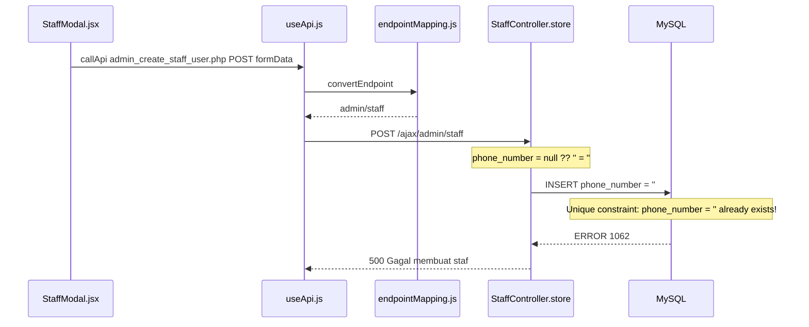
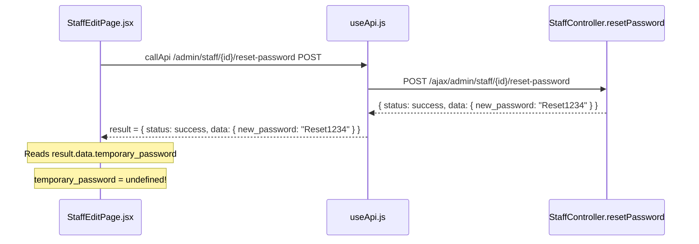

# 🐛 Bugfix: Manajemen Staf (Store Staff & Reset Password)

## Tanggal: 2026-08-04

---

## Ringkasan Bug

Dua bug dilaporkan pada fitur manajemen staf:

1. **Bug 1**: Gagal membuat staf - `Duplicate entry '' for key 'users_phone_number_unique'`
2. **Bug 2**: Reset password menampilkan "undefined" - Password sementara baru adalah: undefined

---

## Analisis Arsitektur

Terdapat **DUA set routes** untuk manajemen staf:

| Route Set | File | Controller | Response Type |
|-----------|------|-----------|---------------|
| Inertia routes | `routes/web.php` | `ActionController` | `back()->with()` (flash session) |
| AJAX routes | `routes/ajax.php` | `StaffController` | `response()->json()` |

Frontend menggunakan **AJAX routes** melalui `callApi()` → `useApi` hook → `convertEndpoint` → `/ajax/admin/staff/...`

---

## Bug 1: Gagal Membuat Staf - Duplicate Entry

### Lokasi
- [`StaffController::store()`](app/Http/Controllers/Admin/StaffController.php:111) baris 139

### Alur Request


### Root Cause
Di [`StaffController.php` baris 139`](app/Http/Controllers/Admin/StaffController.php:139):
```php
'phone_number' => $request->phone_number ?? '',
```

- Frontend [`StaffModal.jsx` baris 11`](resources/js/components/modals/StaffModal.jsx:11) **TIDAK mengirim field `phone_number`**
- `$request->phone_number` = `null`
- Operator `??` (null coalescing) hanya menangkap `null`, menghasilkan `''` (empty string)
- MySQL `UNIQUE` constraint pada `phone_number` → hanya BOLEH ada SATU baris dengan `''`
- Staf pertama berhasil dibuat dengan `phone_number = ''`
- Staf kedua GAGAL karena `''` sudah ada

### Kenapa di Local Aman?
- Setelah `migrate:fresh --seed`, seeder membuat staf dengan `phone_number = '0000000000'` (bukan `''`)
- Belum ada staf lain dengan `phone_number = ''`
- Jadi pembuatan staf pertama berhasil, tapi percobaan berikutnya akan gagal juga

### Fix
Di [`StaffController.php` baris 139`](app/Http/Controllers/Admin/StaffController.php:139):
```php
// SEBELUM (bug):
'phone_number' => $request->phone_number ?? '',

// SESUDAH (fix):
'phone_number' => $request->phone_number ?: null,
```

**Mengapa `null`?** MySQL InnoDB memperbolehkan multiple `NULL` values dalam UNIQUE column. Jadi banyak staf bisa memiliki `phone_number = NULL` tanpa melanggar constraint.

---

## Bug 2: Reset Password Menampilkan "undefined"

### Lokasi
- Backend: [`StaffController::resetPassword()`](app/Http/Controllers/Admin/StaffController.php:253) baris 284
- Frontend: [`StaffEditPage.jsx`](resources/js/Pages/StaffEditPage.jsx:41) baris 41

### Alur Request


### Root Cause
**Key mismatch** antara backend dan frontend:

| | Key | Value |
|---|-----|-------|
| Backend returns | `data.new_password` | `"Reset1234"` |
| Frontend expects | `data.temporary_password` | `undefined` |

Di [`StaffController.php` baris 281-285`](app/Http/Controllers/Admin/StaffController.php:281):
```php
return response()->json([
    'status' => 'success',
    'message' => 'Password staf berhasil direset.',
    'data' => ['new_password' => $newPassword]  // ← key: new_password
]);
```

Di [`StaffEditPage.jsx` baris 41`](resources/js/Pages/StaffEditPage.jsx:41):
```javascript
modal.showAlert({ 
    message: `Password sementara baru adalah: ${result.data.temporary_password}...` 
    // ↑ key: temporary_password → undefined!
});
```

### Fix
Di [`StaffController.php` baris 284`](app/Http/Controllers/Admin/StaffController.php:284):
```php
// SEBELUM (bug):
'data' => ['new_password' => $newPassword]

// SESUDAH (fix):
'data' => ['temporary_password' => $newPassword]
```

---

## Bug Tambahan: Staff Status Update - Field Name Mismatch (POTENSIAL)

### Lokasi
- Frontend: [`StaffListPage.jsx` baris 30`](resources/js/Pages/StaffListPage.jsx:30)
- Backend: [`StaffController::updateStatus()` baris 212`](app/Http/Controllers/Admin/StaffController.php:212)

### Root Cause
Frontend mengirim field `new_status` tapi backend validasi field `status`:

```javascript
// Frontend (StaffListPage.jsx:30):
const result = await callApi(`/admin/staff/${staffId}/status`, 'PUT', 
    { staff_id: staffId, new_status: newStatus }  // ← field: new_status
);
```

```php
// Backend (StaffController.php:212):
$request->validate(['status' => 'required|in:ACTIVE,BLOCKED,SUSPENDED']);
// ↑ field: status → validation error!
```

### Fix
Di [`StaffController.php` baris 212`](app/Http/Controllers/Admin/StaffController.php:212):
```php
// SEBELUM:
$request->validate(['status' => 'required|in:ACTIVE,BLOCKED,SUSPENDED']);

// SESUDAH:
$request->validate(['new_status' => 'required|in:ACTIVE,BLOCKED,SUSPENDED']);
```

Dan baris 227:
```php
// SEBELUM:
$staff->update(['status' => $request->status]);

// SESUDAH:
$staff->update(['status' => $request->new_status]);
```

---

## Checklist Perbaikan

- [ ] **T1**: Fix `StaffController::store()` - ubah phone_number default dari `''` ke `null`
- [ ] **T2**: Fix `StaffController::resetPassword()` - ubah key dari `new_password` ke `temporary_password`
- [ ] **T3**: Fix `StaffController::updateStatus()` - sesuaikan field name `status` → `new_status`
- [ ] **T4**: Verifikasi build frontend
- [ ] **T5**: Test manual semua alur
