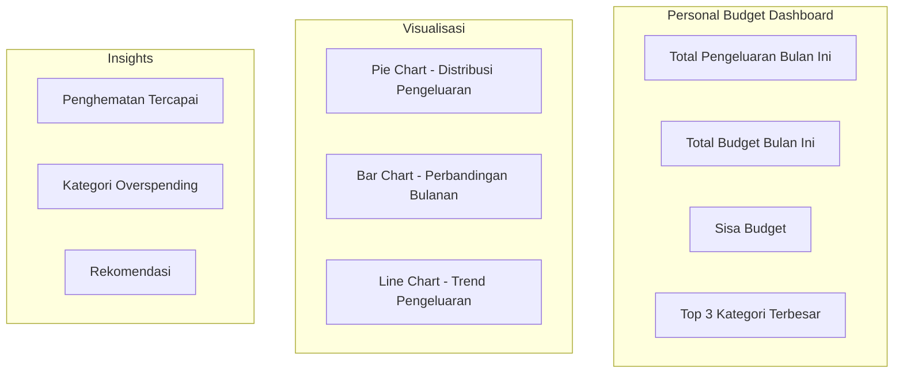
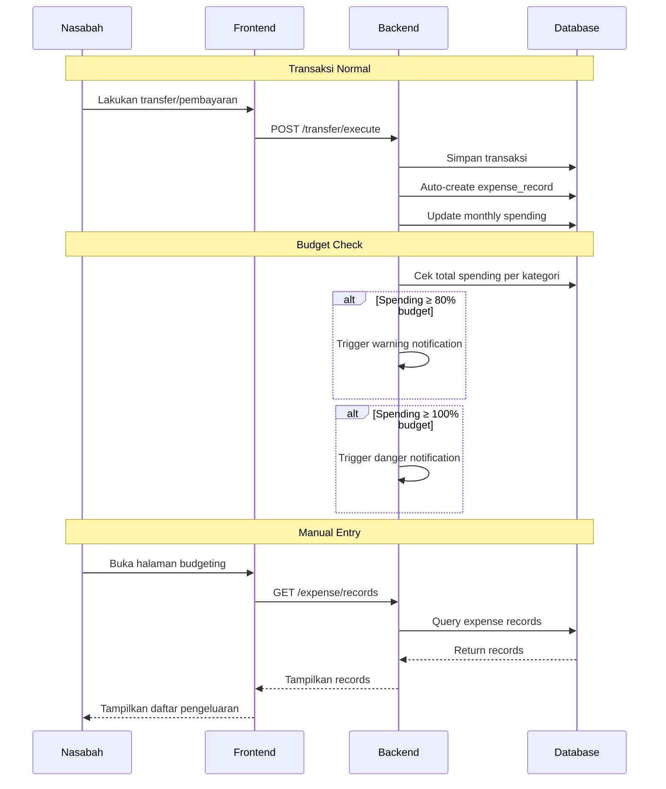

# Rancangan Fitur: Budgeting & Pencatatan Keuangan Pribadi

## 📋 Overview

Fitur **Personal Budgeting** memungkinkan nasabah untuk mencatat, mengelola, dan menganalisis pengeluaran pribadi mereka secara terintegrasi dengan transaksi perbankan yang sudah ada.

---

## 🎯 Goals & Objectives

1. **Membantu nasabah memahami pola pengeluaran** mereka melalui visualisasi data
2. **Memberikan kontrol atas budget** bulanan per kategori pengeluaran
3. **Memberikan notifikasi** saat pengeluaran mendekati atau melebihi budget
4. **Menyediakan rekomendasi** penghematan berdasarkan pola transaksi
5. **Mengintegrasikan** dengan transaksi existing (transfer, pembayaran tagihan, dll)

---

## 👥 Target Users

| User | Kebutuhan |
|------|-----------|
| **Nasabah** | Mencatat pengeluaran, melihat analisis, mengatur budget |
| **Sistem** | Auto-categorize transaksi, generate laporan |

---

## 🗂️ Fitur Breakdown

### 1. Kategori Pengeluaran

#### Kategori Default
| Kategori | Ikon | Deskripsi |
|----------|------|-----------|
| 🍔 Makanan & Minuman | Food | Restoran, kafe, groceries |
| 🚗 Transportasi | Transport | Bensin, parkir, ojek online, tol |
| 🏠 Rumah Tangga | Home | Sewa, listrik, air, internet |
| 🛒 Belanja | Shopping | Pakaian, elektronik, kebutuhan sehari-hari |
| 🎭 Hiburan | Entertainment | Streaming, games, nongkrong |
| 🏥 Kesehatan | Health | Obat, dokter, asuransi kesehatan |
| 📚 Pendidikan | Education | Kursus, buku, sekolah |
| 💰 Tabungan & Investasi | Savings | Transfer ke tabungan, investasi |
| 🎁 Lainnya | Others | Pengeluaran yang tidak masuk kategori lain |

#### Fitur Kategori
- **Auto-categorize**: Sistem otomatis mengkategorikan transaksi berdasarkan merchant/deskripsi
- **Custom category**: Nasabah bisa membuat kategori sendiri
- **Sub-kategori**: Opsional untuk kategori lebih detail

---

### 2. Pencatatan Pengeluaran

#### Manual Entry
```javascript
// Form pencatatan manual
{
  amount: number,        // Jumlah pengeluaran
  category: string,      // Kategori pengeluaran
  description: string,   // Deskripsi/notes
  date: Date,            // Tanggal pengeluaran
  receipt: File,         // Foto struk (opsional)
  is_recurring: boolean  // Apakah pengeluaran berulang
}
```

#### Auto-Import dari Transaksi
- Setiap transaksi yang berhasil akan otomatis masuk ke pencatatan
- Nasabah bisa mengedit kategori dan notes
- Filter transaksi yang ingin dicatat

---

### 3. Budget Management

#### Set Budget per Kategori
```javascript
// Budget bulanan
{
  category: string,      // Kategori
  monthly_limit: number, // Budget bulanan
  alert_threshold: 80    // Persentase alert (default 80%)
}
```

#### Budget Overview
- Progress bar per kategori (terpakai / budget)
- Persentase penggunaan
- Sisa budget yang tersisa

#### Alert System
| Tipe Alert | Trigger | Aksi |
|------------|---------|------|
| Warning | ≥ 80% budget terpakai | Notifikasi in-app |
| Danger | ≥ 100% budget terpakai | Notifikasi push + email |
| Summary | Akhir bulan | Ringkasan pengeluaran bulanan |

---

### 4. Analisis & Visualisasi

#### Dashboard Budgeting


#### Fitur Analisis
1. **Ringkasan Bulanan**
   - Total pengeluaran vs budget
   - Kategori dengan pengeluaran terbesar
   - Penghematan yang berhasil

2. **Trend Analysis**
   - Grafik pengeluaran 3-6 bulan terakhir
   - Perbandingan dengan bulan sebelumnya
   - Identifikasi pola pengeluaran

3. **Insights & Recommendations**
   - "Anda menghabiskan 30% lebih banyak untuk makanan bulan ini"
   - "Coba kurangi pengeluaran di kategori X untuk mencapai target tabungan"

---

### 5. Laporan & Export

#### Laporan Tersedia
| Laporan | Format | Keterangan |
|---------|--------|------------|
| Ringkasan Bulanan | PDF | Total per kategori |
| Detail Transaksi | CSV/Excel | Semua transaksi dengan kategori |
| Perbandingan Bulanan | PDF | Grafik perbandingan |
| Tax Report | PDF | Pengeluaran yang bisa diklaim pajak |

---

## 🗄️ Database Design

### Tabel Baru

#### 1. `expense_categories`
```sql
CREATE TABLE expense_categories (
    id BIGINT PRIMARY KEY AUTO_INCREMENT,
    user_id BIGINT NOT NULL,
    name VARCHAR(100) NOT NULL,
    icon VARCHAR(50),
    color VARCHAR(7),  -- hex color
    is_default BOOLEAN DEFAULT FALSE,
    parent_id BIGINT NULL,  -- untuk sub-kategori
    created_at TIMESTAMP,
    updated_at TIMESTAMP,
    FOREIGN KEY (user_id) REFERENCES users(id),
    FOREIGN KEY (parent_id) REFERENCES expense_categories(id)
);
```

#### 2. `expense_records`
```sql
CREATE TABLE expense_records (
    id BIGINT PRIMARY KEY AUTO_INCREMENT,
    user_id BIGINT NOT NULL,
    transaction_id BIGINT NULL,  -- link ke transaksi jika auto-import
    category_id BIGINT NOT NULL,
    amount DECIMAL(15,2) NOT NULL,
    description TEXT,
    expense_date DATE NOT NULL,
    receipt_path VARCHAR(255),
    is_auto_imported BOOLEAN DEFAULT FALSE,
    created_at TIMESTAMP,
    updated_at TIMESTAMP,
    FOREIGN KEY (user_id) REFERENCES users(id),
    FOREIGN KEY (transaction_id) REFERENCES transactions(id),
    FOREIGN KEY (category_id) REFERENCES expense_categories(id)
);
```

#### 3. `monthly_budgets`
```sql
CREATE TABLE monthly_budgets (
    id BIGINT PRIMARY KEY AUTO_INCREMENT,
    user_id BIGINT NOT NULL,
    category_id BIGINT NOT NULL,
    year INT NOT NULL,
    month INT NOT NULL,
    budget_amount DECIMAL(15,2) NOT NULL,
    alert_threshold INT DEFAULT 80,
    created_at TIMESTAMP,
    updated_at TIMESTAMP,
    UNIQUE KEY unique_budget (user_id, category_id, year, month),
    FOREIGN KEY (user_id) REFERENCES users(id),
    FOREIGN KEY (category_id) REFERENCES expense_categories(id)
);
```

---

## 🔌 API Endpoints

### AJAX Routes (routes/ajax.php)

#### Kategori
```php
// GET /ajax/user/expense/categories
// POST /ajax/user/expense/categories
// PUT /ajax/user/expense/categories/{id}
// DELETE /ajax/user/expense/categories/{id}
```

#### Pencatatan Pengeluaran
```php
// GET /ajax/user/expense/records
// POST /ajax/user/expense/records
// PUT /ajax/user/expense/records/{id}
// DELETE /ajax/user/expense/records/{id}
// POST /ajax/user/expense/records/import  // Auto-import dari transaksi
```

#### Budget
```php
// GET /ajax/user/expense/budgets
// POST /ajax/user/expense/budgets
// PUT /ajax/user/expense/budgets/{id}
// DELETE /ajax/user/expense/budgets/{id}
```

#### Analisis
```php
// GET /ajax/user/expense/summary?month=&year=
// GET /ajax/user/expense/trend?months=6
// GET /ajax/user/expense/insights
```

---

## 🖥️ Frontend Pages

### Halaman Baru

#### 1. `BudgetingPage.jsx`
- Dashboard utama budgeting
- Ringkasan pengeluaran bulan ini
- Progress bar per kategori
- Quick actions (tambah pengeluaran, atur budget)

#### 2. `ExpenseListPage.jsx`
- Daftar semua pengeluaran
- Filter berdasarkan kategori, tanggal, jumlah
- Search dan sort

#### 3. `BudgetSetupPage.jsx`
- Atur budget per kategori
- Set alert threshold
- History perubahan budget

#### 4. `ExpenseAnalyticsPage.jsx`
- Grafik dan chart
- Trend analysis
- Insights dan rekomendasi

#### 5. `ExpenseReportsPage.jsx`
- Generate laporan
- Export ke PDF/CSV
- History laporan

---

## 🔄 Alur Integrasi dengan Transaksi



---

## 📱 UI/UX Design

### Mobile-First Design

#### Dashboard Budgeting
```
┌─────────────────────────────────┐
│  💰 Personal Budget             │
├─────────────────────────────────┤
│  Bulan: Agustus 2026            │
│  ┌───────────────────────────┐  │
│  │ Total: Rp 3.500.000       │  │
│  │ Budget: Rp 5.000.000      │  │
│  │ Sisa: Rp 1.500.000        │  │
│  └───────────────────────────┘  │
│                                 │
│  Kategori:                      │
│  ┌───────────────────────────┐  │
│  │ 🍔 Makanan    70% ██████░░│  │
│  │ 🚗 Transport  45% ████░░░░│  │
│  │ 🏠 Rumah      90% █████████│  │
│  └───────────────────────────┘  │
│                                 │
│  [+ Tambah Pengeluaran]         │
│  [Atur Budget]                  │
│  [Lihat Analisis]               │
└─────────────────────────────────┘
```

---

## ⚙️ Implementation Steps

### Phase 1: Database & Backend
1. Buat migration untuk tabel baru
2. Buat model ExpenseCategory, ExpenseRecord, MonthlyBudget
3. Buat controller ExpenseController
4. Buat service ExpenseService
5. Buat routes AJAX

### Phase 2: Auto-Import Logic
1. Modifikasi TransactionController untuk auto-create expense_record
2. Buat logic auto-categorize berdasarkan merchant/deskripsi
3. Implementasi budget checking setiap transaksi

### Phase 3: Frontend
1. Buat BudgetingPage.jsx (dashboard)
2. Buat ExpenseListPage.jsx
3. Buat BudgetSetupPage.jsx
4. Buat ExpenseAnalyticsPage.jsx
5. Buat ExpenseReportsPage.jsx

### Phase 4: Integration & Testing
1. Integrasi dengan halaman dashboard utama
2. Testing auto-import dari transaksi
3. Testing budget alerts
4. Testing export laporan

---

## 🔒 Security Considerations

1. **Data Isolation**: Setiap user hanya bisa akses data mereka sendiri
2. **Input Validation**: Validasi amount, category, date
3. **CSRF Protection**: Semua AJAX routes sudah terproteksi
4. **Rate Limiting**: Limit jumlah request per menit

---

## 📊 Success Metrics

| Metric | Target |
|--------|--------|
| User adoption | 30% nasabah aktif fitur budgeting |
| Budget set rate | 50% user yang set budget |
| Alert engagement | 70% user merespons alert |
| Data accuracy | 95% transaksi terkategorikan benar |

---

## 🚀 Future Enhancements

1. **AI-Powered Categorization**: Menggunakan ML untuk auto-categorize lebih akurat
2. **Bill Splitting**: Fitur split bill dengan teman/keluarga
3. **Savings Goals**: Integrasi dengan Goal Savings yang sudah ada
4. **Merchant Insights**: Rekomendasi merchant berdasarkan pola belanja
5. **Tax Optimization**: Suggest pengeluaran yang bisa diklaim pajak
