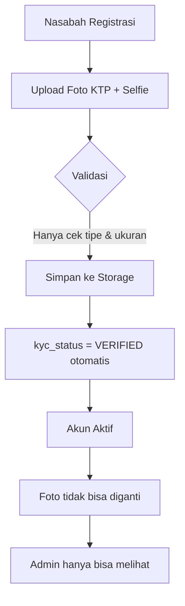
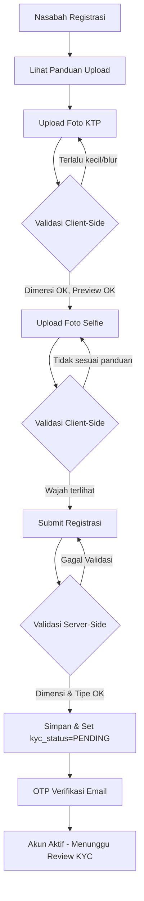
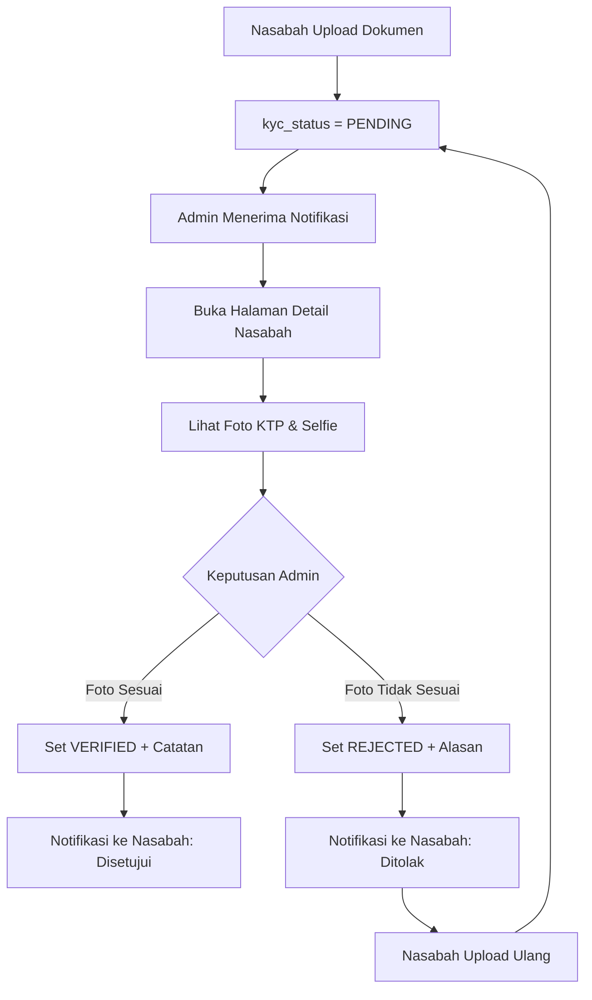
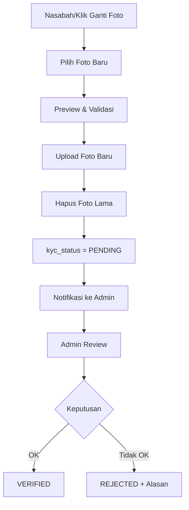

# 🔧 Rencana Perbaikan Sistem Verifikasi KYC

> Masalah: Foto KTP & Swafoto masih "ngasal" - nasabah bisa upload foto tidak sesuai, dan setelah disetujui susah diganti.

---

## 📋 Daftar Isi

1. [Analisis Masalah](#analisis-masalah)
2. [Rencana Perbaikan](#rencana-perbaikan)
3. [Alur Kerja Baru](#alur-kerja-baru)
4. [Daftar Tugas Implementasi](#daftar-tugas-implementasi)

---

## Analisis Masalah

### 🔴 Masalah yang Ditemukan:

| # | Masalah | Lokasi | Dampak |
|---|---------|--------|--------|
| 1 | **Tidak ada validasi konten foto** | [`RegisterPage.jsx`](resources/js/Pages/RegisterPage.jsx:76-88), [`RegisterController.php`](app/Http/Controllers/Auth/RegisterController.php:40-41) | Nasabah bisa upload foto apapun (screenshot, meme, dll) |
| 2 | **KYC otomatis VERIFIED saat registrasi** | [`RegisterController.php`](app/Http/Controllers/Auth/RegisterController.php:105) | Tidak ada proses verifikasi manual |
| 3 | **Tidak ada cara ganti foto KYC** | [`ProfileController.php`](app/Http/Controllers/User/ProfileController.php), [`ProfileInfoPage.jsx`](resources/js/Pages/ProfileInfoPage.jsx) | Setelah registrasi, foto tidak bisa diubah |
| 4 | **Admin tidak bisa replace foto** | [`CustomerDetailPage.jsx`](resources/js/Pages/CustomerDetailPage.jsx:190-195) | Admin hanya bisa melihat, tidak bisa mengganti |
| 5 | **Tidak ada panduan upload** | [`RegisterPage.jsx`](resources/js/Pages/RegisterPage.jsx:166-167) | Nasabah tidak tahu foto seperti apa yang harus diupload |
| 6 | **Tidak ada minimum dimensi** | Validasi backend | Foto bisa sangat kecil/blur |

### 🔴 Alur Saat Ini (Bermasalah):



---

## Rencana Perbaikan

### ✅ Perbaikan 1: Panduan Upload yang Jelas

**File:** [`RegisterPage.jsx`](resources/js/Pages/RegisterPage.jsx)

Tambahkan panduan visual sebelum upload:
- Contoh foto KTP yang benar (placeholder/gambar panduan)
- Contoh foto selfie dengan KTP yang benar
- Checklist: NIK terlihat jelas, wajah terlihat jelas, tidak blur, dll

### ✅ Perbaikan 2: Validasi Client-Side Lebih Ketat

**File:** [`RegisterPage.jsx`](resources/js/Pages/RegisterPage.jsx)

- Validasi minimum dimensi gambar (contoh: 600x400 px)
- Preview foto sebelum submit dengan highlight area penting
- Warning jika foto terlalu gelap/kecil

### ✅ Perbaikan 3: Validasi Server-Side Lebih Ketat

**File:** [`RegisterController.php`](app/Http/Controllers/Auth/RegisterController.php), [`ActionController.php`](app/Http/Controllers/Inertia/ActionController.php)

- Tambah validasi minimum dimensi gambar (getimagesize)
- Tambah validasi file corrupt
- Log semua upload untuk audit trail

### ✅ Perbaikan 4: Endpoint Ganti Foto KYC (Customer)

**File:** [`ProfileController.php`](app/Http/Controllers/User/ProfileController.php)

Tambah method baru:
```php
public function updateKycDocuments(Request $request): JsonResponse
{
    // Validasi: ktp_image required_without:selfie_image, selfie_image required_without:ktp_image
    // Upload foto baru
    // Hapus foto lama
    // Set kyc_status = PENDING (menunggu review admin)
    // Kirim notifikasi ke admin
}
```

### ✅ Perbaikan 5: Endpoint Ganti Foto KYC (Admin)

**File:** [`CustomerController.php`](app/Http/Controllers/Admin/CustomerController.php)

Tambah method baru:
```php
public function updateKycDocuments(Request $request, $id): JsonResponse
{
    // Admin bisa ganti foto KTP/Selfie nasabah
    // Set kyc_status = VERIFIED/REJECTED
    // Tambah kyc_notes
    // Kirim notifikasi ke nasabah
    // Log audit trail
}
```

### ✅ Perbaikan 6: UI Admin - Replace Foto KYC

**File:** [`CustomerDetailPage.jsx`](resources/js/Pages/CustomerDetailPage.jsx)

- Tombol "Ganti Foto" di section Dokumen KYC
- Upload form inline/modal
- Status KYC badge (PENDING/VERIFIED/REJECTED)
- Catatan admin (kyc_notes)

### ✅ Perbaikan 7: UI Customer - Update Foto KYC

**File:** [`ProfileInfoPage.jsx`](resources/js/Pages/ProfileInfoPage.jsx) atau buat page baru [`KycDocumentPage.jsx`](resources/js/Pages/KycDocumentPage.jsx)

- Tampilkan status KYC saat ini
- Tombol "Perbarui Dokumen KYC"
- Upload form untuk KTP dan/atau Selfie
- Info: "Dokumen akan diverifikasi oleh admin"

### ✅ Perbaikan 8: Notifikasi Perubahan Status KYC

**File:** [`CustomerController.php`](app/Http/Controllers/Admin/CustomerController.php)

- Saat admin approve: notifikasi ke nasabah "Dokumen KYC telah diverifikasi"
- Saat admin reject: notifikasi ke nasabah "Dokumen KYC ditolak, silakan upload ulang"
- Saat nasabah upload ulang: notifikasi ke admin "Ada dokumen KYC baru perlu review"

---

## Alur Kerja Baru

### 🔵 Alur Registrasi (Diperbaiki):



### 🔵 Alur Review KYC (Baru):



### 🔵 Alur Ganti Foto (Baru):



---

## Daftar Tugas Implementasi

### Backend (Laravel)

- [ ] **T1: Tambah validasi dimensi gambar di `RegisterController.php`**
  - Cek minimum dimensi 600x400 px menggunakan `getimagesize()`
  - Return error yang jelas jika tidak memenuhi

- [ ] **T2: Tambah validasi dimensi gambar di `ActionController.php` (storeCustomer)**
  - Sama seperti T1 untuk admin yang menambah nasabah

- [ ] **T3: Buat method `updateKycDocuments()` di `ProfileController.php`**
  - Upload foto baru (KTP dan/atau Selfie)
  - Hapus foto lama dari storage
  - Set `kyc_status = PENDING`
  - Kirim notifikasi ke admin

- [ ] **T4: Buat method `updateKycDocuments()` di `CustomerController.php`**
  - Admin bisa ganti foto KYC nasabah
  - Set `kyc_status` (VERIFIED/REJECTED)
  - Tambah `kyc_notes`
  - Kirim notifikasi ke nasabah
  - Log audit trail

- [ ] **T5: Tambah route di `routes/ajax.php`**
  - `POST /ajax/user/kyc/update` (customer)
  - `POST /ajax/admin/customers/{id}/kyc` (admin)

- [ ] **T6: Tambah route di `routes/web.php`**
  - `GET /profile/kyc-documents` (customer page)

### Frontend (React)

- [ ] **T7: Buat page `KycDocumentPage.jsx`**
  - Tampilkan status KYC saat ini
  - Upload form untuk KTP & Selfie
  - Panduan upload yang jelas
  - Preview foto sebelum submit

- [ ] **T8: Update `RegisterPage.jsx`**
  - Tambah panduan visual upload KTP
  - Tambah panduan visual upload selfie
  - Validasi dimensi gambar client-side
  - Preview dengan highlight area penting

- [ ] **T9: Update `CustomerDetailPage.jsx`**
  - Tambah tombol "Ganti Foto KYC"
  - Modal/form untuk upload foto baru
  - Status KYC badge (PENDING/VERIFIED/REJECTED)
  - Input catatan admin (kyc_notes)
  - Tombol Approve/Reject

- [ ] **T10: Update `ProfilePage.jsx`**
  - Tambah menu "Dokumen KYC" 
  - Link ke KycDocumentPage

- [ ] **T11: Update `ProfileInfoPage.jsx`**
  - Tampilkan status KYC
  - Link ke halaman update KYC

### Notifikasi

- [ ] **T12: Tambah notifikasi KYC status change**
  - Ke nasabah saat status berubah
  - Ke admin saat ada upload baru

---

## File yang Perlu Diubah

| File | Perubahan |
|------|-----------|
| [`app/Http/Controllers/Auth/RegisterController.php`](app/Http/Controllers/Auth/RegisterController.php) | Validasi dimensi gambar |
| [`app/Http/Controllers/Inertia/ActionController.php`](app/Http/Controllers/Inertia/ActionController.php) | Validasi dimensi gambar |
| [`app/Http/Controllers/User/ProfileController.php`](app/Http/Controllers/User/ProfileController.php) | Method updateKycDocuments |
| [`app/Http/Controllers/Admin/CustomerController.php`](app/Http/Controllers/Admin/CustomerController.php) | Method updateKycDocuments + review |
| [`routes/ajax.php`](routes/ajax.php) | Route baru |
| [`routes/web.php`](routes/web.php) | Route page baru |
| [`resources/js/Pages/RegisterPage.jsx`](resources/js/Pages/RegisterPage.jsx) | Panduan upload + validasi |
| [`resources/js/Pages/CustomerDetailPage.jsx`](resources/js/Pages/CustomerDetailPage.jsx) | Ganti foto + review KYC |
| [`resources/js/Pages/ProfilePage.jsx`](resources/js/Pages/ProfilePage.jsx) | Menu KYC |
| [`resources/js/Pages/KycDocumentPage.jsx`](resources/js/Pages/KycDocumentPage.jsx) | **BARU** - Halaman update KYC |
| [`app/Http/Controllers/Inertia/UserPageController.php`](app/Http/Controllers/Inertia/UserPageController.php) | Method untuk render page KYC |

---

## Catatan Production

⚠️ **PENTING:**
- Tidak ada perubahan database (migration) yang diperlukan
- Semua perubahan adalah tambahan kode (additive)
- Tidak ada `migrate:fresh` atau `migrate:rollback`
- Deploy dengan hati-hati, test di staging dulu
- Backup storage sebelum deploy

---

*Last updated: August 2026*
