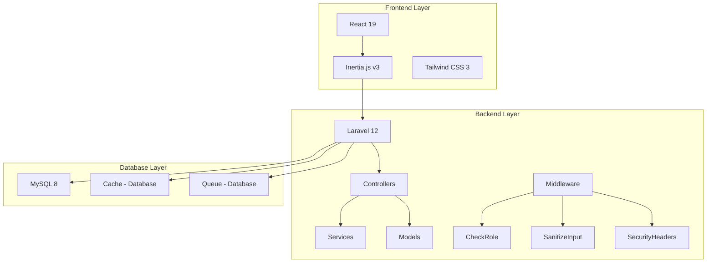
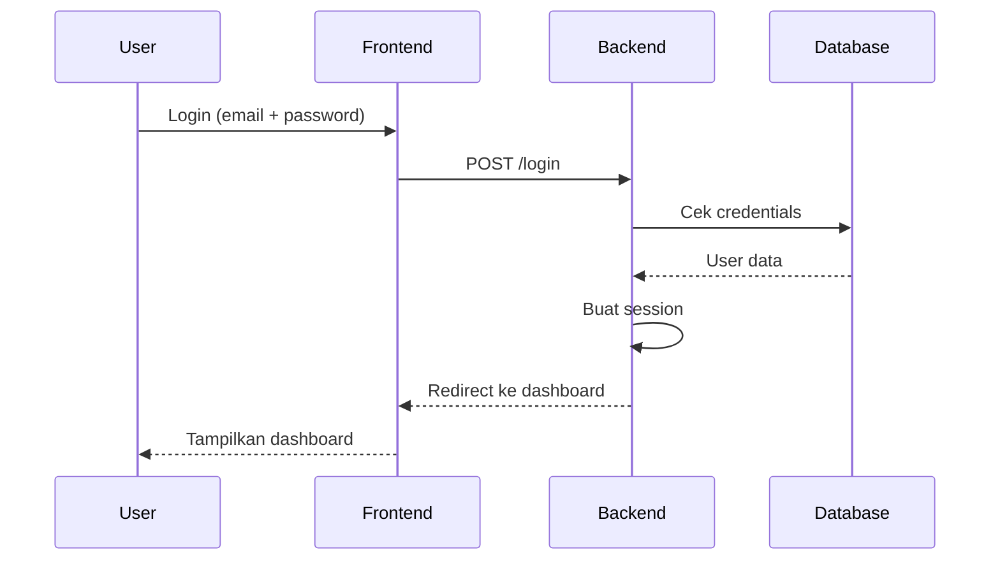
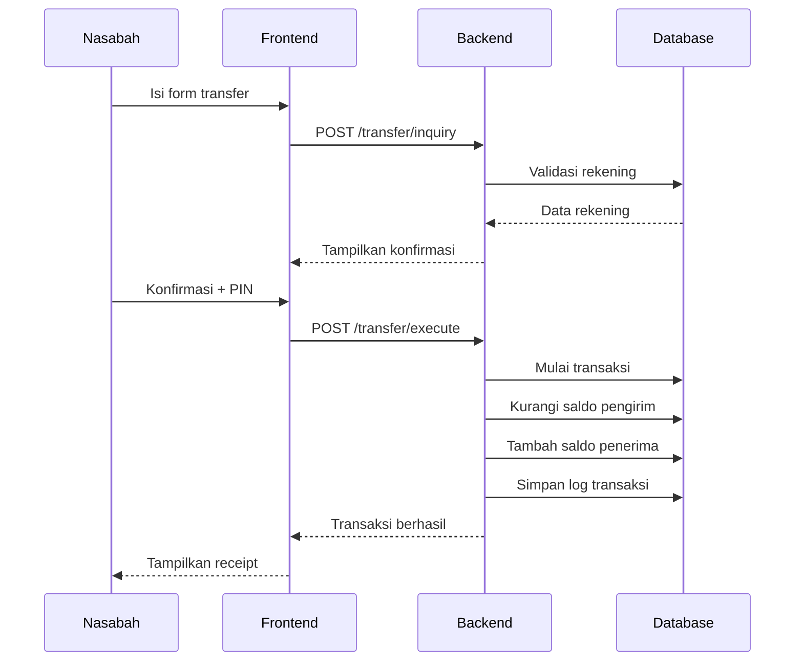
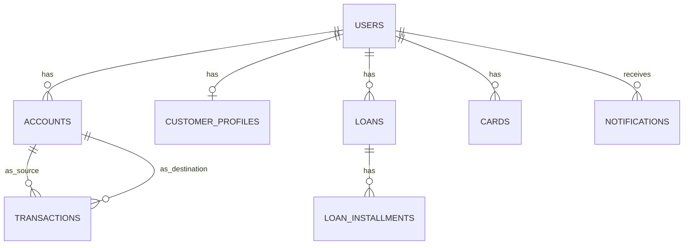

# Panduan Pelajari Proyek A2U Bank Digital

## 📋 Ringkasan Proyek

**A2U Bank Digital** adalah platform perbankan digital berbasis web yang dibangun dengan arsitektur monolith menggunakan **Laravel 12 + Inertia.js + React**. Aplikasi ini mendukung operasional nasabah (mobile banking) dan back-office staf bank dalam satu aplikasi.

---

## 🛠️ Tech Stack

| Layer | Teknologi | Keterangan |
|-------|-----------|------------|
| **Backend** | Laravel 12, PHP 8.2+ | Framework PHP modern dengan fitur keamanan bawaan |
| **Frontend** | React 19, Inertia.js v3 | SPA tanpa API terpisah, rendering server-side |
| **Styling** | Tailwind CSS 3 | Utility-first CSS framework |
| **Database** | MySQL 8 | Relational database untuk data transaksi |
| **Build Tool** | Vite | Bundler modern untuk asset frontend |
| **Queue/Cache** | Database driver | Untuk job async dan caching |
| **Push Notification** | Web Push (VAPID) | Notifikasi push ke browser |

---

## 🏗️ Arsitektur Sistem



---

## 📁 Struktur Direktori Utama

### Backend (PHP/Laravel)
```
app/
├── Console/Commands/           # Artisan commands (scheduler jobs)
│   ├── CheckOverdueInstallments.php
│   ├── ProcessScheduledTransfers.php
│   └── ProcessStandingInstructions.php
├── Http/Controllers/
│   ├── Admin/                  # Controller untuk staf bank
│   ├── User/                   # Controller untuk nasabah
│   ├── Auth/                   # Autentikasi (login, register)
│   ├── Inertia/                # Controller render halaman Inertia
│   └── Api/                    # API endpoints
├── Http/Middleware/
│   ├── CheckRole.php           # Authorization berdasarkan role
│   ├── SanitizeInput.php       # Input sanitization
│   └── SecurityHeaders.php     # HTTP security headers
├── Models/                     # Eloquent models (32 model)
├── Services/                   # Business logic services
│   ├── EmailService.php
│   ├── NotificationService.php
│   └── LogService.php
└── Jobs/
    └── SendEmailJob.php        # Queue job untuk email
```

### Frontend (React/Inertia)
```
resources/js/
├── Pages/                      # 72 halaman React (Inertia)
│   ├── *Page.jsx               # Halaman utama
│   └── Admin*Page.jsx          # Halaman admin
├── components/
│   ├── admin/                  # Komponen admin
│   ├── customer/               # Komponen nasabah
│   ├── layout/                 # Layout components
│   ├── modals/                 # Modal dialogs
│   ├── ui/                     # UI components
│   └── utils/                  # Utility components
├── contexts/                   # React contexts
├── hooks/                      # Custom React hooks
└── Layouts/                    # Layout wrappers
```

### Database (Migrations)
```
database/migrations/
├── 0001_01_01_000000_create_users_table.php
├── 2024_01_01_000001_create_roles_table.php
├── 2024_01_01_000005_create_accounts_table.php
├── 2024_01_01_000006_create_transactions_table.php
└── ... (58 total migrations)
```

---

## 👥 Sistem Role & Akses

### Role Nasabah
| Role | Keterangan |
|------|------------|
| `customer` | Nasabah bank dengan akses fitur mobile banking |

### Role Staf Bank (Back-Office)
| Role | Akses Utama |
|------|-------------|
| `super_admin` | Akses penuh semua fitur, konfigurasi sistem |
| `admin` | Akses luas termasuk manajemen staf |
| `manager` (Kepala Cabang/Unit) | Dashboard cabang, laporan, approval |
| `marketing` | Data nasabah, produk, kampanye |
| `teller` | Transaksi tunai, top-up, verifikasi |
| `cs` (Customer Service) | Tiket, pesan langsung, manajemen akun |
| `analyst` (Analis Kredit) | Review & approval pengajuan pinjaman |
| `debt_collector` | Monitoring angsuran & penagihan |

---

## 🔐 Fitur Keamanan

1. **Autentikasi**
   - Login dengan email/password
   - PIN transaksi (6 digit)
   - OTP untuk registrasi dan reset password
   - 2FA (Two-Factor Authentication) opsional

2. **Otorisasi**
   - Role-based access control (RBAC)
   - Middleware `CheckRole` untuk setiap route
   - Middleware `SanitizeInput` untuk input validation

3. **Proteksi CSRF**
   - CSRF token via cookie `XSRF-TOKEN`
   - Header `X-X-XSRF-TOKEN` pada setiap AJAX request
   - Tidak ada route yang dikecualikan

4. **Security Headers**
   - X-Content-Type-Options
   - X-Frame-Options
   - X-XSS-Protection
   - Content-Security-Policy

---

## 🔄 Alur Aplikasi Utama

### Alur Autentikasi


### Alur Transaksi Transfer


---

## 📊 Database Schema (Inti)

### Tabel Utama
1. **users** - Data pengguna (nasabah & staf)
2. **roles** - Role/permission
3. **accounts** - Rekening bank nasabah
4. **transactions** - Log transaksi
5. **customer_profiles** - Profil lengkap nasabah
6. **loans** - Data pinjaman
7. **loan_installments** - Jadwal cicilan
8. **cards** - Kartu debit/kredit
9. **deposit_products** - Produk deposito
10. **notifications** - Notifikasi user

### Relasi Database


---

## 🚀 Deployment

### Environment
- **Production**: VPS Ubuntu dengan aaPanel
- **Web Server**: Nginx
- **PHP Version**: 8.2+
- **Node.js**: 20+ (untuk build frontend)

### Instalasi
```bash
# PHP dependencies
composer install --no-dev --optimize-autoloader

# JS dependencies & build
npm install
npm run build

# Setup database
php artisan migrate --seed
php artisan storage:link
php artisan vapid:generate
```

### Scheduler Jobs
| Job | Jadwal | Fungsi |
|-----|--------|--------|
| `transfers:process-scheduled` | Harian 00:05 | Proses transfer terjadwal |
| `transfers:process-standing` | Harian 00:10 | Proses standing instruction |
| `loans:check-overdue` | Harian 01:00 | Cek angsuran jatuh tempo |

---

## 🧪 Testing

### Akun Testing
| Role | Email | Password |
|------|-------|----------|
| Super Admin | admin@a2ubank.com | admin123 |
| Teller | teller@a2ubank.com | teller123 |
| Customer Service | cs@a2ubank.com | cs123 |
| Nasabah 1 | customer1@example.com | customer123 |

> PIN nasabah default: `123456`

### Test Files
```
tests/Feature/
├── BugConditionExplorationTest.php
├── CardManagementBugfixTest.php
├── DeleteCustomerTest.php
├── LoanDeletionTest.php
├── PreservationPropertyTest.php
└── ProfilePictureTest.php
```

---

## 📚 Dokumentasi Tambahan

- [PERBAIKAN_ADMIN_DEPOSIT_LIST.md](PERBAIKAN_ADMIN_DEPOSIT_LIST.md) - Fix deposit list admin
- [PERBAIKAN_DEPOSIT_DETAIL.md](PERBAIKAN_DEPOSIT_DETAIL.md) - Fix deposit detail
- [PERBAIKAN_DEPOSITO.md](PERBAIKAN_DEPOSITO.md) - Fix deposito
- [PERBAIKAN_ERROR_CONSOLE.md](PERBAIKAN_ERROR_CONSOLE.md) - Console error fixes
- [PERBAIKAN_LOAN_APPLICATIONS.md](PERBAIKAN_LOAN_APPLICATIONS.md) - Loan applications fix
- [PERBAIKAN_SYNTAX_ERROR.md](PERBAIKAN_SYNTAX_ERROR.md) - Syntax error fixes
- [FITUR_FORGOT_PIN.md](FITUR_FORGOT_PIN.md) - Forgot PIN feature
- [SECURITY_AUDIT_REPORT.md](SECURITY_AUDIT_REPORT.md) - Security audit
- [SECURITY_FIXES_SUMMARY.md](SECURITY_FIXES_SUMMARY.md) - Security fixes summary
- [PRODUCTION_CHECKLIST.md](PRODUCTION_CHECKLIST.md) - Production deployment checklist

---

## 🎯 Tips Pelajari Proyek

### Pemula (Mulai dari sini)
1. Baca **README.md** untuk overview lengkap
2. Pelajari struktur database di `database/migrations/`
3. Pahami model utama di `app/Models/`
4. Lihat route di `routes/web.php` dan `routes/ajax.php`

### Intermediate
1. Pelajari controller di `app/Http/Controllers/`
2. Pahami middleware di `app/Http/Middleware/`
3. Lihat service layer di `app/Services/`
4. Pelajari queue jobs di `app/Jobs/`

### Advanced
1. Pelajari frontend React di `resources/js/Pages/`
2. Pahami komponen reusable di `resources/js/components/`
3. Lihat deployment scripts di `deploy.sh` dan `deploy-production.sh`
4. Pelajari security audit di `SECURITY_AUDIT_REPORT.md`

---

## 🔗 Links Penting

- **Repository**: GitHub (lihat deploy.sh untuk URL)
- **Production**: https://yourdomain.com (konfigurasi di .env)
- **API Health Check**: `/up`
- **Documentation**: README.md dan dokumen .md lainnya
