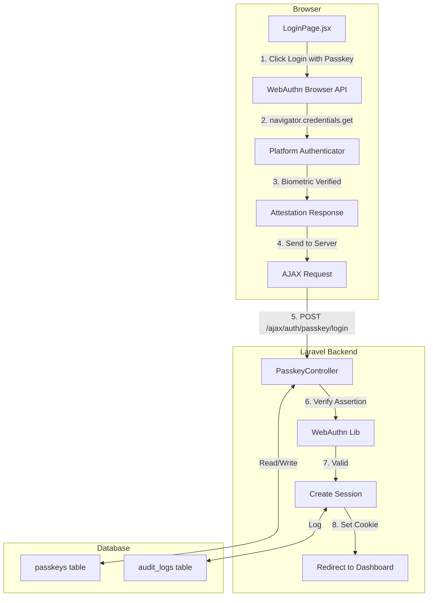
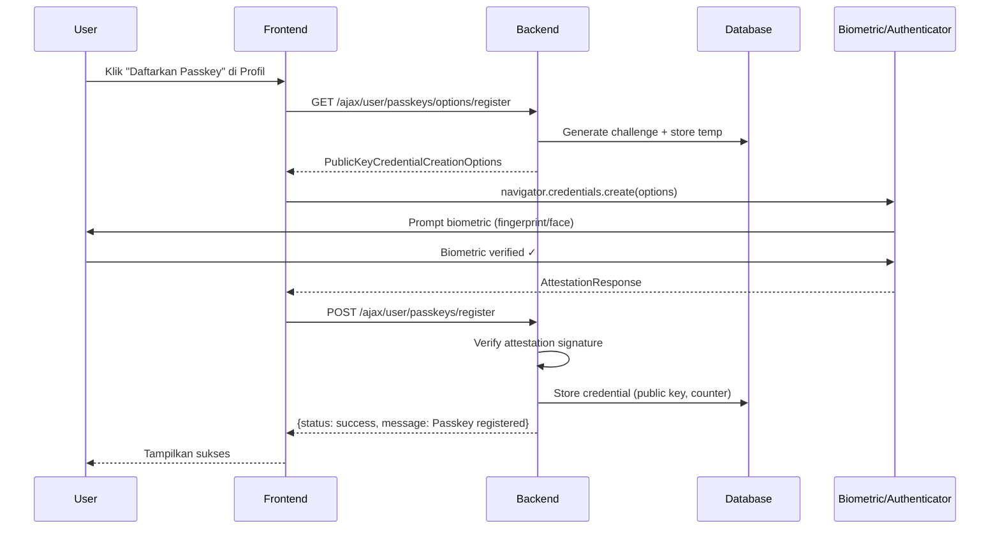
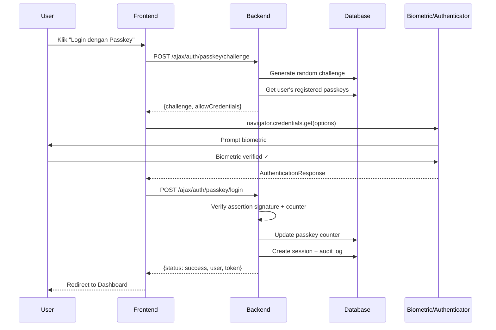

# 🔐 Rencana Implementasi WebAuthn/Passkeys (Biometric Login)

> **Tanggal:** 6 Agustus 2026
> **Status:** Production System — Butuh pendekatan hati-hati
> **Target:** Biometric login (fingerprint/face ID/Windows Hello) via WebAuthn/FIDO2

---

## 📋 Daftar Isi

1. [Ringkasan Eksekutif](#ringkasan-eksekutif)
2. [Arsitektur Solusi](#arsitektur-solusi)
3. [Alur Kerja](#alur-kerja)
4. [Database Schema](#database-schema)
5. [Backend Implementation](#backend-implementation)
6. [Frontend Implementation](#frontend-implementation)
7. [Security Considerations](#security-considerations)
8. [Daftar Task Implementasi](#daftar-task-implementasi)

---

## Ringkasan Eksekutif

### Apa itu WebAuthn/Passkeys?

WebAuthn (Web Authentication API) adalah standar W3C yang memungkinkan user melakukan autentikasi menggunakan **biometric** (fingerprint, face ID), **hardware security key** (YubiKey), atau **platform authenticator** (Windows Hello, Touch ID, Face ID) — langsung dari browser.

### Mengapa Passkeys?

| Aspek | Password | OTP/SMS | Passkeys |
|-------|----------|---------|----------|
| Keamanan | Rentan phishing | Bisa di-SIM swap | **Phishing-resistant** |
| UX | Harus ingat password | Menunggu kode | **1 tap + biometric** |
| Kecepatan | Normal | Lambat | **< 1 detik** |
| Standar | — | — | **FIDO2/W3C** |
| Bank Grade | ❌ | ⚠️ | ✅ |

### Scope Implementasi

1. **Registrasi Passkey** — User mendaftarkan biometric device setelah login
2. **Login dengan Passkey** — User login tanpa password, cukup biometric
3. **Manajemen Passkey** — List, rename, hapus passkeys di halaman profil
4. **Fallback** — Login dengan password tetap tersedia

---

## Arsitektur Solusi

### Stack Teknologi

| Layer | Technology | Alasan |
|-------|-----------|--------|
| PHP Backend | `web-auth/webauthn-lib` v4.x | Library WebAuthn PHP paling matang (FIDO Alliance) |
| JS Frontend | `@simplewebauthn/browser` v10.x | Wrapper clean untuk WebAuthn API di browser |
| Database | MySQL — table `passkeys` baru | Tidak mengubah table yang sudah ada |
| Session | Laravel Sanctum (existing) | Tetap gunakan session-based auth yang sudah ada |

### Diagram Arsitektur



---

## Alur Kerja

### Alur 1: Registrasi Passkey (Setelah Login dengan Password)



### Alur 2: Login dengan Passkey (Tanpa Password)



---

## Database Schema

### Table Baru: `passkeys`

```sql
CREATE TABLE passkeys (
    id BIGINT UNSIGNED AUTO_INCREMENT PRIMARY KEY,
    user_id BIGINT UNSIGNED NOT NULL,
    
    -- FIDO2 Credential Data
    credential_id VARCHAR(255) NOT NULL,
    public_key TEXT NOT NULL,
    counter BIGINT UNSIGNED DEFAULT 0,
    
    -- Device Info
    device_name VARCHAR(100) DEFAULT NULL COMMENT 'User-friendly name, e.g. iPhone 15 Pro',
    device_type ENUM('platform', 'cross-platform') DEFAULT 'platform',
    authenticator_type ENUM('singleDevice', 'multiDevice') DEFAULT 'singleDevice',
    
    -- Attestation Data
    attestation_format VARCHAR(50) DEFAULT NULL,
    aaguid VARCHAR(36) DEFAULT NULL COMMENT 'Authenticator AAGUID identifier',
    
    -- Status
    is_active BOOLEAN DEFAULT TRUE,
    last_used_at TIMESTAMP NULL,
    
    -- Timestamps
    created_at TIMESTAMP DEFAULT CURRENT_TIMESTAMP,
    updated_at TIMESTAMP DEFAULT CURRENT_TIMESTAMP ON UPDATE CURRENT_TIMESTAMP,
    
    -- Constraints
    UNIQUE KEY uk_credential_id (credential_id),
    CONSTRAINT fk_passkeys_user FOREIGN KEY (user_id) REFERENCES users(id) ON DELETE CASCADE,
    INDEX idx_passkeys_user_id (user_id),
    INDEX idx_passkeys_credential_id (credential_id)
) ENGINE=InnoDB DEFAULT CHARSET=utf8mb4 COLLATE=utf8mb4_unicode_ci;
```

**Catatan Penting:**
- Table BARU, tidak mengubah table `users` yang sudah ada
- `credential_id` di-encode sebagai base64url string
- `public_key` disimpan sebagai JSON object (COSE key format)
- `counter` untuk replay attack prevention

---

## Backend Implementation

### 1. Install Dependencies

```bash
composer require web-auth/webauthn-lib:^4.0
```

### 2. New Files

| File | Purpose |
|------|---------|
| `app/Http/Controllers/User/PasskeyController.php` | CRUD passkeys + register/login |
| `app/Services/PasskeyService.php` | Business logic WebAuthn |
| `app/Models/Passkey.php` | Eloquent model |
| `database/migrations/YYYY_MM_DD_create_passkeys_table.php` | Migration |
| `resources/js/hooks/useWebAuthn.js` | Frontend WebAuthn helper hook |
| `resources/js/Pages/PasskeyManagePage.jsx` | Passkey management UI |

### 3. Controller Endpoints

```
# Customer Routes (role:customer)
GET    /ajax/user/passkeys                    → Index (list passkeys)
POST   /ajax/user/passkeys/register/options    → Generate registration options
POST   /ajax/user/passkeys/register            → Verify & store registration
DELETE /ajax/user/passkeys/{id}                → Delete passkey
PUT    /ajax/user/passkeys/{id}               → Rename passkey

# Public Auth Routes (no auth required)
POST   /ajax/auth/passkey/challenge           → Generate login challenge
POST   /ajax/auth/passkey/login               → Verify assertion & login
```

### 4. Service Layer (PasskeyService.php)

Method utama:
- `generateRegistrationOptions(User $user)` — Buat challenge + options untuk `credentials.create()`
- `verifyRegistration(array $credential, User $user)` — Verifikasi attestation + simpan credential
- `generateAuthenticationOptions(?int $userId)` — Buat challenge untuk `credentials.get()`
- `verifyAuthentication(array $credential)` — Verifikasi assertion + update counter
- `getUserPasskeys(int $userId)` — List passkeys user
- `deletePasskey(int $passkeyId, int $userId)` — Hapus passkey
- `renamePasskey(int $passkeyId, int $userId, string $name)` — Rename passkey

### 5. Integration Points

#### 5a. Modifikasi AuthPageController

Tambahkan method `passkeyLogin()` untuk render halaman login dengan opsi passkey:

```php
// Di AuthPageController.php
public function passkeyLogin() {
    // Check if WebAuthn is supported
    return Inertia::render('LoginPage', [
        'webauthnSupported' => true, // Detected client-side
    ]);
}
```

#### 5b. Modifikasi LoginPage.jsx

Tambahkan tombol "Login dengan Passkey" di bawah form password:

```jsx
// Di LoginPage.jsx — tambah section
{webauthnSupported && (
    <div className="mt-4">
        <div className="relative">
            <div className="absolute inset-0 flex items-center">
                <div className="w-full border-t border-gray-300" />
            </div>
            <div className="relative flex justify-center text-sm">
                <span className="px-2 bg-white text-gray-500">atau</span>
            </div>
        </div>
        <button
            type="button"
            onClick={handlePasskeyLogin}
            className="mt-4 w-full flex items-center justify-center gap-2 ..."
        >
            <FingerprintIcon /> Login dengan Passkey
        </button>
    </div>
)}
```

#### 5c. Routes (ajax.php)

Tambahkan routes baru di file `routes/ajax.php`:

```php
// Public auth routes — Passkey
Route::middleware(['web', 'throttle:10,1'])->prefix('auth/passkey')->group(function () {
    Route::post('/challenge', [PasskeyController::class, 'challenge']);
    Route::post('/login', [PasskeyController::class, 'login']);
});

// Customer routes — Passkey Management
Route::middleware(['web', 'auth:web', 'role:customer'])->prefix('user/passkeys')->group(function () {
    Route::get('/', [PasskeyController::class, 'index']);
    Route::post('/register/options', [PasskeyController::class, 'registerOptions']);
    Route::post('/register', [PasskeyController::class, 'register']);
    Route::put('/{id}', [PasskeyController::class, 'rename']);
    Route::delete('/{id}', [PasskeyController::class, 'destroy']);
});
```

---

## Frontend Implementation

### 1. Install Dependencies

```bash
npm install @simplewebauthn/browser
```

### 2. useWebAuthn Hook

```javascript
// resources/js/hooks/useWebAuthn.js
import { startRegistration, startAuthentication } from '@simplewebauthn/browser';

export function useWebAuthn() {
    const isSupported = () => {
        return window.PublicKeyCredential !== undefined 
            && typeof window.PublicKeyCredential === 'function';
    };

    const register = async () => {
        // 1. Get options from server
        const optionsRes = await fetch('/ajax/user/passkeys/register/options', { ... });
        const options = await optionsRes.json();
        
        // 2. Call WebAuthn API
        const credential = await startRegistration(options.data);
        
        // 3. Send credential to server for verification
        const verifyRes = await fetch('/ajax/user/passkeys/register', {
            method: 'POST',
            body: JSON.stringify(credential),
            ...
        });
        return verifyRes.json();
    };

    const authenticate = async (email) => {
        // 1. Get challenge from server
        const challengeRes = await fetch('/ajax/auth/passkey/challenge', {
            method: 'POST',
            body: JSON.stringify({ email }),
            ...
        });
        const options = await challengeRes.json();
        
        // 2. Call WebAuthn API
        const assertion = await startAuthentication(options.data);
        
        // 3. Send assertion to server for verification
        const verifyRes = await fetch('/ajax/auth/passkey/login', {
            method: 'POST',
            body: JSON.stringify(assertion),
            ...
        });
        return verifyRes.json();
    };

    return { isSupported, register, authenticate };
}
```

### 3. Passkey Management Page

Halaman baru di halaman profil untuk mengelola passkeys:
- **List** semua passkeys yang terdaftar (device name, tanggal daftar, terakhir dipakai)
- **Tambah** passkey baru (register)
- **Rename** passkey (ganti nama device)
- **Hapus** passkey

---

## Security Considerations

### ✅ Yang Sudah Aman

1. **Challenge-Response** — Setiap transaksi menggunakan random challenge, tidak ada replay
2. **Origin Verification** — Browser otomatis verify origin domain
3. **Counter Check** — Setiap autentikasi increment counter, mendeteksi replay
4. **No Shared Secret** — Private key tidak pernah meninggalkan device

### ⚠️ Yang Perlu Diperhatikan

1. **Origin Binding** — Challenge harus di-generate server-side, tidak client-side
2. **Rate Limiting** — Endpoint login harus di-rate-limit (sudah ada: `throttle:10,1`)
3. **Audit Log** — Setiap registrasi/login passkey harus di-log ke `audit_logs`
4. **Session Management** — Passkey login harus buat session yang sama dengan password login
5. **Account Lockout** — Jika user lupa semua passkey, harus bisa login dengan password
6. **Device Trust** — Passkeys bersifat device-specific, user harus register per-device

### 🔒 Anti-Phishing

WebAuthn secara inheren anti-phishing karena:
- Browser hanya mengirim response ke domain yang benar
- Tidak ada password yang bisa di-phish
- Credential terikat pada origin (domain) spesifik

---

## Daftar Task Implementasi

### Phase 1: Backend Foundation

- [ ] Install `web-auth/webauthn-lib` via Composer
- [ ] Buat migration `create_passkeys_table`
- [ ] Buat Model `Passkey.php`
- [ ] Buat Service `PasskeyService.php`
- [ ] Buat Controller `PasskeyController.php`
- [ ] Tambah routes di `routes/ajax.php`
- [ ] Buat Seeder untuk testing (opsional)

### Phase 2: Frontend WebAuthn

- [ ] Install `@simplewebauthn/browser` via npm
- [ ] Buat hook `useWebAuthn.js`
- [ ] Modifikasi `LoginPage.jsx` — tambah tombol Passkey Login
- [ ] Buat `PasskeyManagePage.jsx` — halaman manajemen passkey
- [ ] Tambah route page di `routes/web.php`
- [ ] Tambah link ke passkey management di `ProfilePage.jsx`

### Phase 3: Integration & Testing

- [ ] Integrasikan passkey login flow dengan session management
- [ ] Pastikan audit logging berfungsi
- [ ] Test di Chrome (Windows Hello + Android)
- [ ] Test di Safari (Touch ID + Face ID)
- [ ] Test di Firefox (Security Key fallback)
- [ ] Handle edge cases (device not supported, timeout, etc.)

### Phase 4: Deployment

- [ ] Jalankan migration di production
- [ ] Clear cache (`php artisan config:cache && php artisan route:cache`)
- [ ] Test di production URL
- [ ] Update documentation

---

## Estimasi File yang Diubah/Dibuat

### File Baru (6 files)
| File | Type |
|------|------|
| `app/Http/Controllers/User/PasskeyController.php` | Backend |
| `app/Services/PasskeyService.php` | Backend |
| `app/Models/Passkey.php` | Backend |
| `database/migrations/YYYY_MM_DD_create_passkeys_table.php` | Migration |
| `resources/js/hooks/useWebAuthn.js` | Frontend |
| `resources/js/Pages/PasskeyManagePage.jsx` | Frontend |

### File Yang Diubah (4-5 files)
| File | Perubahan |
|------|-----------|
| `routes/ajax.php` | Tambah passkey routes |
| `routes/web.php` | Tambah page route untuk passkey management |
| `resources/js/Pages/LoginPage.jsx` | Tambah tombol "Login dengan Passkey" |
| `resources/js/Pages/ProfilePage.jsx` | Tambah link ke "Kelola Passkey" |
| `composer.json` | Tambah dependency `web-auth/webauthn-lib` |

---

*Document created: 6 August 2026*
*Author: AI Architect Agent*
